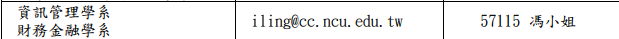

# 國立中央大學轉學生報到與學分抵免清單

## 🏫 第零部分：原校離校手續與準備（過來人經驗提醒！）

在開始新學校的報到前，請務必先處理好原學校的離校程序，以免影響自身權益：

- [ ] **確認放榜與報到意願（正備取皆須注意）：** `[來源: 暑假轉學考全攻略]`
  - 將放榜日加入行事曆提醒。確認為正取或備取後，皆須**上網登記報到意願**（備取生須先登錄意願，待遞補後才繳交資料）。
- [ ] **下載/申請「課程大綱 (Syllabus)」：** `[來源: 暑假轉學考全攻略]`
  - 趁原校系統權限還在時，務必將所有修過科目的**課程大綱**下載備份，這是未來新校教授審核學分抵免的關鍵依據！若系統無法下載，請向教務處洽詢替代方案。
- [ ] **確認辦理「退學」或「休學」並跑離校簽核：** `[來源: PTT Transfer 板 (www.ptt.cc) / 暑假轉學考全攻略]`
  - 需確認兩校對於「雙重學籍」的規定，決定申請退學或休學。*(參考：[實踐退學流程範例](https://www.dcard.tw/f/all/p/224449255?ref=android))*
  - **離校簽核準備：** 先從原校網站下載離校申請表，並帶妥**學生證**。需跑遍各單位（圖資、行政、系所等）簽核。
  - **時間預估：** 建議預留**半天至一天**。務必提前聯絡班導師與各處室行政人員，確認他們在位置上，避免撲空。
- [ ] **儘早申請「修業證明」與「歷年成績單」：** `[來源: PTT Transfer 板 / 暑假轉學考全攻略]`
  - 雖然學校可能會說需要 3-7 天工作天，但**越早辦理，等待時間通常越短**，有時甚至隔天就能拿到。
  - **份數建議：** 建議至少申請 **2 份**（若學校將修業證明與成績單黏在一起，則建議再追加一份），報到與學分抵免皆會用到（多申請幾份以備不時之需，如不小心遺失等）。
- [ ] **學雜費減免與學貸（⚠️ 低收生極重要）：** `[來源: PTT Transfer 板 (www.ptt.cc)]`
  - **低收減免額度：** 每位學生僅有「四年共八個學期」的額度，若降轉則不可重複申請已經使用過之學期的減免。
  - **退回原校減免：** 若原校已為您申請下學期的減免，**務必在原校上繳教育部期限前，親自去原校（如會計室）辦理「退掉」下學期減免**，這樣才能將額度保留給新學校使用！
- [ ] **學生證優惠異動：** `[來源: PTT Transfer 板 (www.ptt.cc)]`
  - 辦理離校後，原校學生證通常會被「刷退」。雖然可能仍保有悠遊卡功能，但**會失去多數學生票優惠**（如捷運不再打折，僅部分公車有優惠），直到拿到新學校發放且完成認證的學生證為止。

---

## 📅 第一部分：轉學生報到流程清單

今年的報到方式為**「一律採用 Email 報到」**，不需親自到校。請依據以下流程完成：

### 🔴 階段一：正式報到（期限：8/12 早上 9 點 ~ 8/19 晚上 12 點前）

這是確認入學資格最重要的一步，逾期視同放棄！

- [ ] **登入招生系統填寫資料：**
  - 於 **8/12 (三) 上午 9:00 起**，前往 [中央大學招生系統](https://cis.ncu.edu.tw/ExamRegister/)。
  - 登入（帳號通常為身分證字號，密碼為准考證號碼），點選「錄取報到」。
- [ ] **印出報到表並簽名：**
  - 系統內資料填妥後，印出 A4 大小的「新生報到表」。
  - **本人親筆簽名**，並將**身分證正反面影本**黏貼於指定位置。
- [ ] **備妥其他必備文件：**
  - **歷年成績單正本** `[來源: 中央大學報到簡章]`（辦理學分抵免也會用到，建議多申請幾份）。
  - **轉學修業證明書** `[來源: PTT Transfer 板 (www.ptt.cc)]`（若來不及在期限內拿到，莫急莫慌！請先印下並填寫報到簡章附的「具結書/切結書」以延後繳交，之後在期限內補齊即可）。
  - **其他常見應備文件（依各校簡章為準）：** `[來源: 暑假轉學考全攻略]` 證件照片、兵役役籍調查表（男生）等。若不巧忘記帶或缺件，記得主動詢問是否有補繳機會。
- [ ] **掃描並 Email 寄送：**
  - 將上述文件（報到表、成績單、修業證明書/切結書）合併掃描成**一個 PDF 檔**。
  - Email 寄給「資管系」對應的承辦人員信箱（請參考報到程序說明 PDF 中的聯絡人）。iling@cc.ncu.edu.tw / 57115 馮小姐
- [ ] 我
  - 

### 🟡 階段二：後續帳號開通與學分抵免

- [ ] **開通 Portal 帳號 (8/28起)：**
  - 8/28 後，前往 [中央大學 Portal (iNCU)](https://portal.ncu.edu.tw) 開通學生帳號，這將是你未來選課與辦理抵免的重要入口。
- [ ] **線上申請學分抵免 (約開學前後)：**
  - 留意行事曆，登入 Portal 內的「學分抵免系統」填報。
  - 將系統印出的**抵免申請表**連同**歷年成績單正本（需用螢光筆標記欲抵免科目）**，交給資管系系辦公室初審。

---

## 📝 第二部分：學分抵免準備清單（FCU 抵免 中央資管）

> **💡 抵免原則與注意事項：** `[來源: 暑假轉學考全攻略 / 中央大學抵免規定]`
>
> 1. **學分要求：** 原校課程學分「大於或等於」新校學分，且課程名稱/大綱相近，抵免成功率最高（原校少於新校則無法抵免）。
> 2. **大綱備查：** 強烈建議攜帶原本修課的 **課程大綱 (Syllabus)** 供教授判斷。部分領域重要核心課程，必須由該科教授親自確認是否可抵。
> 3. **抵免上限：** 各校對於轉學生抵免學分數可能有上限規定，辦理前可先向教務處確認。
> 4. **分流審核：** 中央大學針對共同必修（國文、英文）、體育、通識與系必修有不同的審核單位，請務必分門別類準備並送交對應單位。

### 1. 共同必修與通識（審核單位：通識中心/語文中心/體育室）

這些是全校共通的必備學分，幾乎都能順利抵免：

- [ ] **體育 (必修)：**
  - FCU `體育(一)`、`體育(二)` ➡️ 可抵免中央大一的體育 (上/下)。
- [ ] **國文 (必修)：**
  - FCU `中文思辨與表達(一)`、`(二)` (各 2 學分) ➡️ 可抵免中央大一國文。
- [ ] **英文 (必修)：**
  - FCU `大學基礎英文(一)(二)中高級` ➡️ 可抵免中央大一英文。
- [ ] **通識課程：**
  - FCU `科學與人文的對話`、`現代公民與社會實踐`、`向儒道思想學情緒管理`、`生命起源與生物科技` ➡️ 依據中央大學通識中心的領域分類分別申請抵免。

### 2. 資管系專業必修（審核單位：資管系辦公室）

請對照中央資管系的課表，將下列逢甲科目填入抵免申請單：

- [ ] **微積分：**
  - FCU `微積分(一)`、`(二)` (各 3 學分) ➡️ 抵免中央大一 `微積分` (上下)。
- [ ] **計算機概論：**
  - FCU `計算機概論` (2 學分) ➡️ 抵免中央大一 `計算機概論Ⅰ` (需確認中央計概學分數，若為 3 學分，可能須補修學分差)。
- [ ] **程式設計相關：**
  - FCU `程式設計(I) ~ (IV)` (各 2 學分)、`Python程式編程與應用` ➡️ 抵免中央大一的 `程式設計` 與 `初階程式設計`。
- [ ] **資料結構：**
  - FCU `資料結構` (3 學分) ➡️ 抵免中央大二 `資料與檔案結構`。
- [ ] **資料庫系統：**
  - FCU `資料庫系統` (3 學分) ➡️ 抵免中央大二 `資料庫管理`。
- [ ] **通訊與網路概論：**
  - FCU `通訊與網路概論` (3 學分) ➡️ 抵免中央大二 `企業資料通訊`。
- [ ] **統計與數學：**
  - FCU `機率與統計` (3 學分) ➡️ 抵免中央院訂必修 `統計學`。

### 3. 彈性/專業選修（可嘗試爭取抵免）

若以下科目非中央資管必修，建議申請抵免為**「系外選修」**或**「系專業選修」**：

- [ ] **離散數學、線性代數：** 雖然偏向資工系必修，但對資管非常有幫助，通常可抵為專業選修。
- [ ] **系統程式、工程數學(二)：** 建議申請抵為選修。
- [ ] **普通物理 (含實驗)、邏輯設計 (含實驗)：** 若資管系不承認，可申請抵為「一般選修學分」。
- [ ] **生成式AI應用：AI agent 開發與實作：** 很有機會抵免中央大三的 `人工智慧與機器學習` 或作為高階資訊選修學分。
