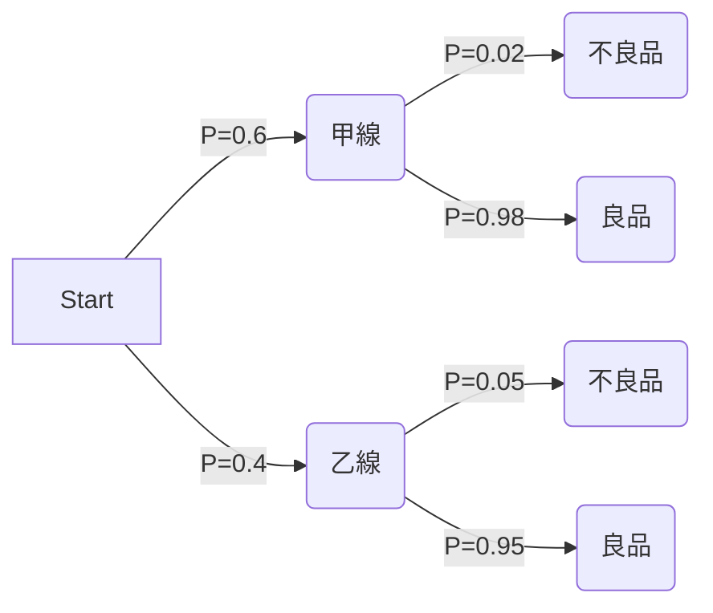

# 🚑 機率與統計 考前最後急救站 (Last-Minute Rescue)

根據你剛才錯的題目，我幫你把明天的「必考盲點」整理成這份急救包！請在進考場前把這幾條規則看熟，分數絕對能救回來！

## 🚨 盲點 1：獨立 (Independent) vs 互斥 (Mutually Exclusive)
- **互斥 (不可能同時發生)** 👉 $P(A \cap B) = 0$
- **獨立 (發生互不影響)** 👉 **$P(A \cap B) = P(A) \times P(B)$** 
> **💡 考場急救：** 看到題目寫「獨立」，第一步直接把交集寫成兩個機率相乘！

## 🚨 盲點 2：條件機率的「集合交集」
計算 $P(A \mid A \cup B)$ 時，分子是 $P(A \cap (A \cup B))$。
> **💡 考場急救：** 因為 $A$ 已經包含在 $A \cup B$ 裡面了，所以他們的交集就是 **$A$ 自己**！分子直接寫 $P(A)$ 即可。

## 🚨 盲點 3：貝氏定理無腦解法 👉 「畫樹狀圖」
不要背貝氏定理那串超長的公式，用畫圖的最快最準！
以第三題 (甲乙線生不良品) 為例：

> **💡 考場急救 (求條件機率)：**
> 1. **分母 (全機率)** = 所有走到「不良品」的路線相加 
>    👉 $(0.6 \times 0.02) + (0.4 \times 0.05) = 0.032$
> 2. **分子** = 題目問的「指定路線」 (例如來自乙線的不良品) 
>    👉 $0.4 \times 0.05 = 0.020$
> 3. **答案** = 分子 / 分母 👉 $0.020 / 0.032 = 0.625$

## 🚨 盲點 4：連續型期望值的「少乘一個 x」
計算 $E[X] = \int x \cdot f(x) dx$。
> **💡 考場急救：** 很多人拿到 $f(x)$ 就直接開始積分，**錯！** 算期望值時，一定要先把 $f(x)$ **乘上 $x$** 之後再積分！

## 🚨 盲點 5：條件期望值大魔王 $E[X \mid X \le a]$
如果你只積了 $\int_0^a x \cdot f(x) dx$，那你只算了一半！
> **💡 考場急救：** 算完上面的積分後，**一定要除以 $P(X \le a)$ (即分母)**！這點在歷屆試題中坑殺了無數人。

## 🚨 盲點 6：線性組合 $W = aX - bY + c$ (獨立時)
給定 $E[X], E[Y]$ 與 $Var(X), Var(Y)$：
- **算期望值 $E[W]$：** 數字照抄！👉 $aE[X] - bE[Y] + c$
- **算變異數 $Var(W)$：** 
  1. 常數 $c$ 直接消失 (變數沒有變異)。
  2. 係數 $a, -b$ **一定要平方**，所以負號會變正號！
  3. 👉 **$Var(W) = a^2Var(X) + b^2Var(Y)$** 
> **💡 考場急救：** 算變異數時，看到加減常數直接劃掉；看到減號 $(-bY)$，平方後一律變成加的！
